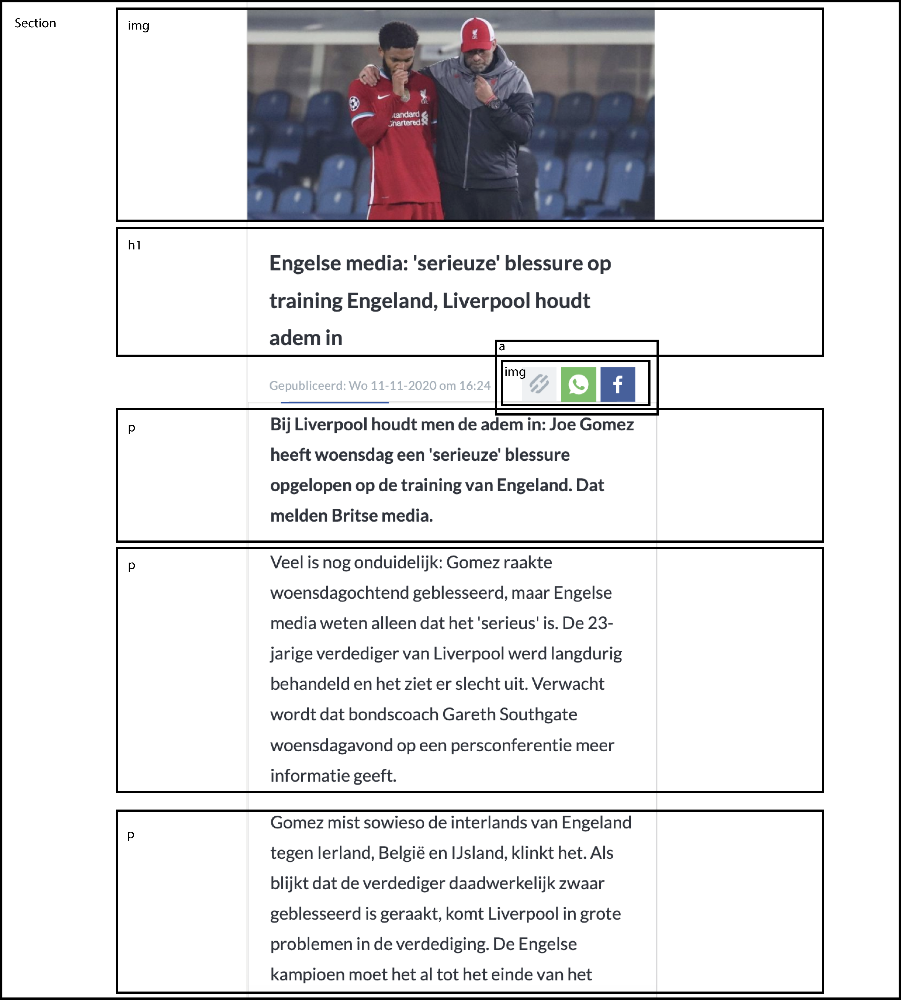
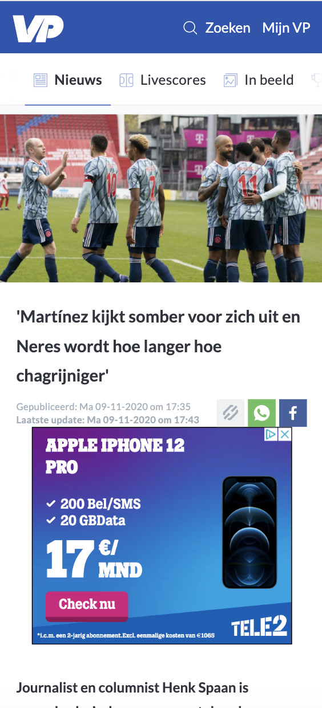
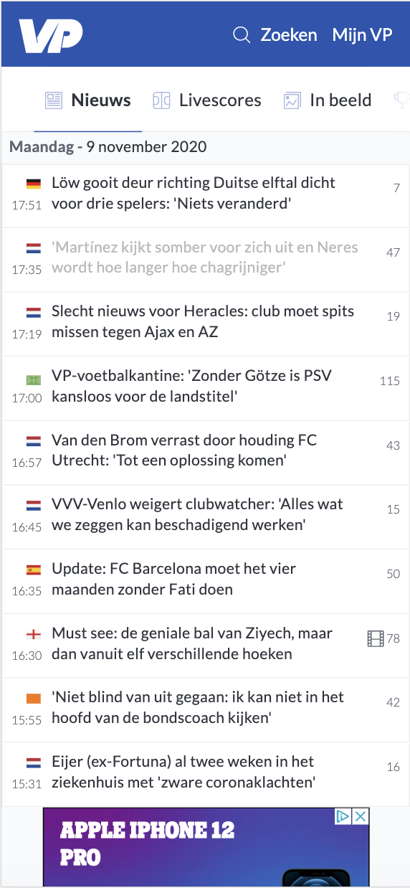
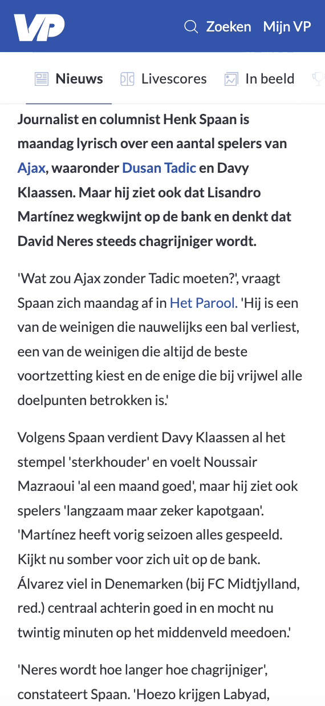

# Procesverslag
**Auteur:** -Wessel Glansbeek-

Markdown cheat cheet: [Hulp bij het schrijven van Markdown](https://github.com/adam-p/markdown-here/wiki/Markdown-Cheatsheet). Nb. de standaardstructuur en de spartaanse opmaak zijn helemaal prima. Het gaat om de inhoud van je procesverslag. Besteedt de tijd voor pracht en praal aan je website.

## Bronnenlijst
1. -bron 1-
2. -bron 2-
3. -...-

## Eindgesprek (week 7/8)

-dit ging goed & dit was lastig-

**Screenshot(s):**

-screenshot(s) van je eindresultaat-

## Voortgang 3 (week 6)

-same as voortgang 1-

## Voortgang 2 (week 5)

-same as voortgang 1-

## Voortgang 1 (week 3)

### Stand van zaken

-Ik vind het lastig te coderen met een blanco scherm voor me. Wanneer ik meekijk als iemand anders codeert snap ik het altijd wel-

**Screenshot(s):**

-header en nav beginnetje gemaakt-

### Agenda voor meeting

-samen met je groepje opstellen-

| Wessel         | Nick               | Redouane     | Ugur             |
| ---            | ---                | ---          | ---              |
| slideshow      | nav sticky         | vragen vooraf| afwezig          |
| meer results   | code semantiek     | nog een punt |                  |
| ...            | hb menu uitklappen | ...          | ...              |

### Verslag van meeting

-na afloop snel uitkomsten vastleggen-

## Breakdownschets (week 1)

-uitwerken voor de 1e werkgroep - eind van de eerste week-

## Intake (week 1)
-uitwerken voor de kick-off werkgroep - begin van de eerste week-

**Je startniveau:** -blauw-

**Je focus:** -responsive-

**Je opdracht:** -voetbalprimeur.nl-

**Screenshot(s) van de eerste pagina (small screen):**

**Screenshot(s) van de tweede pagina (small screen):**

